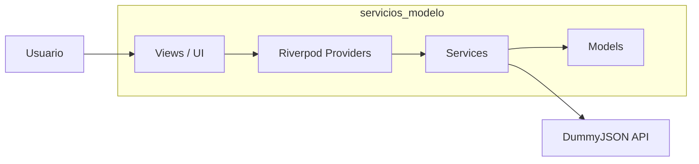
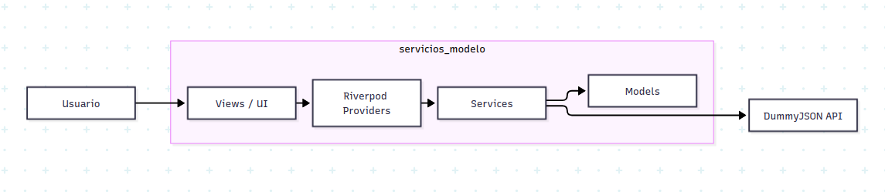

# Diagrama C4 nivel 2 - servicios_modelo

Este proyecto sigue una arquitectura por capas con Riverpod:

- Capa de presentación: vistas y widgets
- Capa de estado: providers de Riverpod
- Capa de datos: servicios y modelos
- Capa externa: API de DummyJSON

## Descripción

- La vista no conoce cómo se cargan los datos: solo consume providers.
- Los providers orquestan la lógica de estado y coordinar la fuente de datos.
- Los servicios encapsulan las llamadas HTTP y la transformación de JSON.
- Los modelos representan el dominio para que la UI trabaje con tipos seguros.
